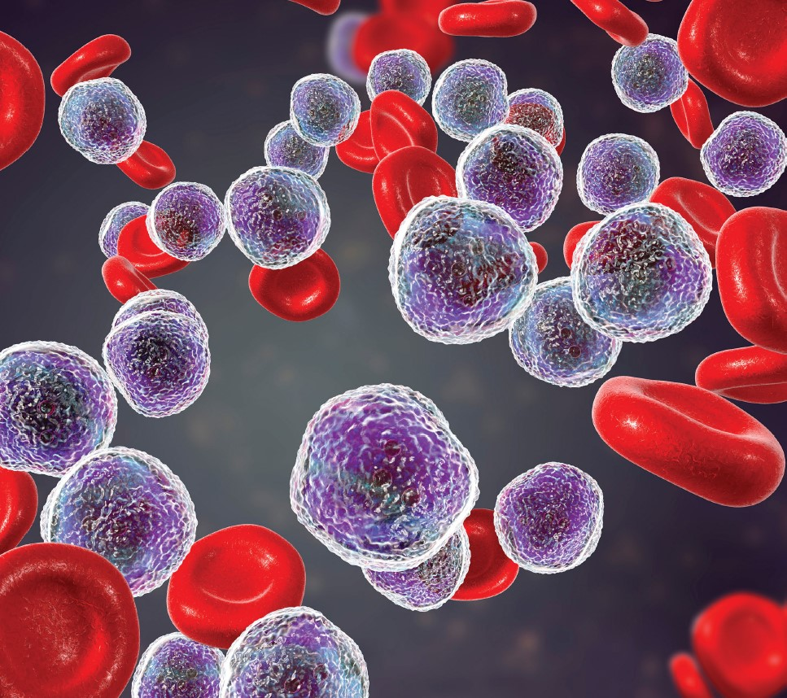

<p align="center"></p>

This repository contains the MAIDS description for project U21-01. It was built by cloning the [MAIDS-Template](https://github.com/PERSIMUNE/MAIDS-Template). You will find more details about this dataset below with links to visit the website and download the PDF.

>MAIDS is currently being prototyped for the [Copenhagen Ultrathon on Precision Medicine](https://ultrathon.online) where you will find more information about the event. You may also be interested in viewing other examples listed in the 2021 Ultrathon [Project Pool](https://github.com/UltrathonOnline/U21-PROJECT-POOL).

There are several ways to stay informed:
* Visit the Ultrathon's [landing page](https://ultrathon.online) and sign up to the mailing list.
* Follow us on [Twitter](https://twitter.com/UltrathonOnline).
* Watch the repository for changes.

---

### **&#10149; U21-06**
#### **Predict risk of infection (blood culture drawn) and chance of treatment free survival 4 years from start of first CLL treatment**
<p align="center"></p>

>Visit the [website](https://ultrathononline.github.io/MAIDS.U21-06.CLLTIM/) for this dataset or download the formatted [PDF](./docs/maids.pdf).
```
Carsten U. Niemann, Rudi Agius
@: Rigshospitalet, Copenhagen, Denmark

Infections are the leading cause of mortality in CLL. Risk of Infection is increased upon CLL treatment and
currently we have no model that is able to predict risk of infection upon CLL treatment. The dataset created
puts together various sources of time-series electronic health records on CLL patients in Denmark. This also
includes outcome on death, treatment and infection. Using this data set we aim to both model risk of infection
upon CLL treatment and uncover risk factors responsible for low immune function and duration of treatment
response upon different treatment regimens.
```